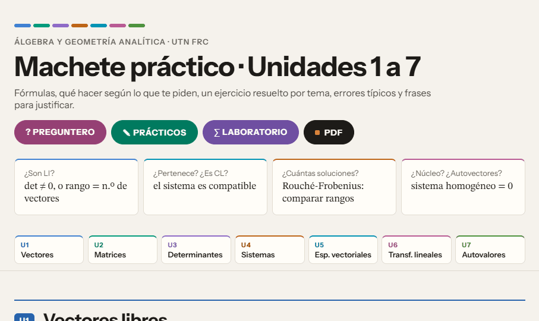
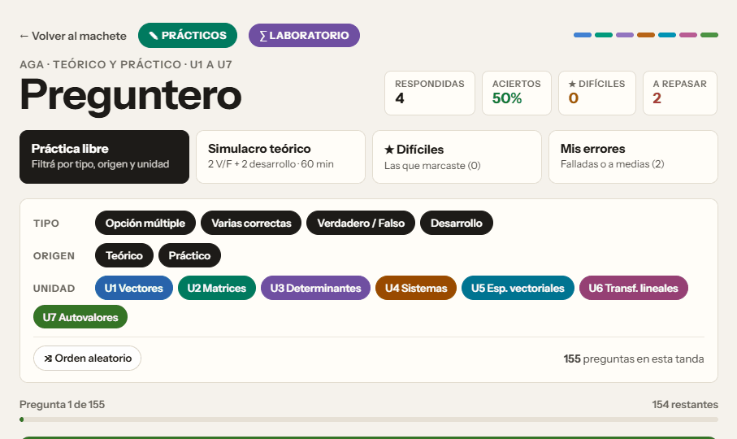
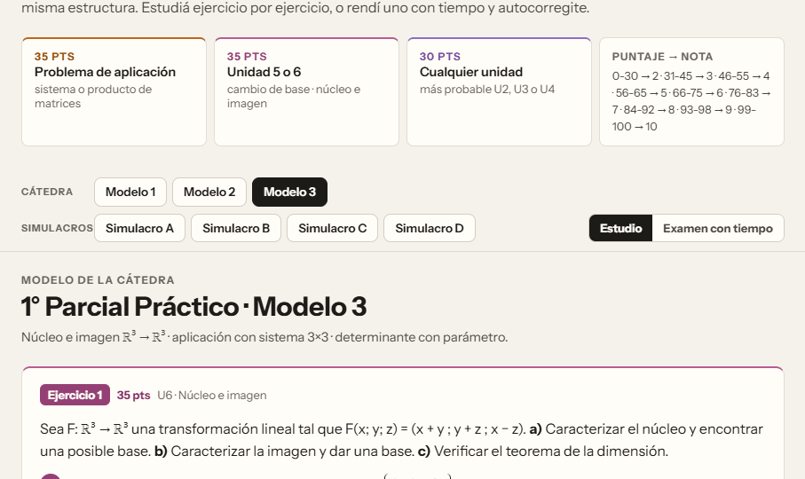
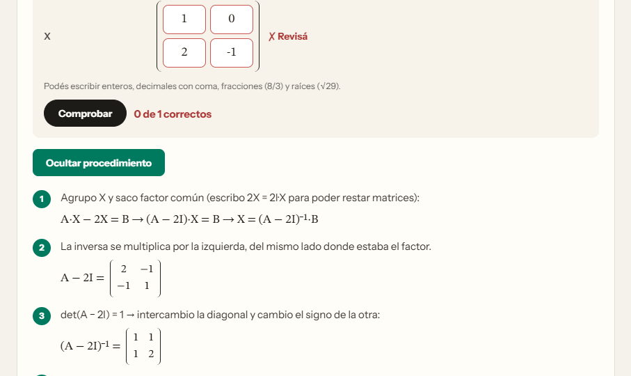

<div align="center">



# 📐 AGA · 1er Parcial

### Todo lo que necesitás para el primer parcial de **Álgebra y Geometría Analítica** (UTN FRC), en un solo lugar.

[](https://gabibertero.github.io/AGA-primerparcial/)


[📘 Machete](https://gabibertero.github.io/AGA-primerparcial/) &nbsp;·&nbsp; [❓ Preguntero](https://gabibertero.github.io/AGA-primerparcial/preguntero.html) &nbsp;·&nbsp; [✎ Prácticos](https://gabibertero.github.io/AGA-primerparcial/practicos.html) &nbsp;·&nbsp; [∑ Laboratorio](https://gabibertero.github.io/AGA-primerparcial/laboratorio.html)

</div>

---

## 📘 Machete
> El resumen para tener al lado mientras estudiás.

Cada unidad viene con:

- 🧮 **Fórmulas y propiedades**, cada una con una aclaración corta de qué significa.
- 🎯 **"¿Qué me piden?"**: tarjetas con *me dan → me piden → entonces*, para saber qué hacer apenas leés el enunciado.
- ✅ **Ejercicio resuelto tipo parcial**, paso a paso y con verificación.
- ⚠️ **Errores comunes**: los que más bajan puntos, como restar los puntos al revés, olvidarse de trasponer la adjunta o poner `A − 2` en vez de `A − 2I`.
- 💬 **Frases para justificar**, listas para escribir en la hoja.

🖨️ El botón **PDF** arma una versión en escala de grises, compacta y lista para imprimir doble faz, con números de página.

---

## ❓ Preguntero
> Más de 150 preguntas de teoría y práctica de todas las unidades.



| Modo | Para qué sirve |
|---|---|
| 🎲 **Práctica libre** | Filtrás por unidad, teoría o práctica, y tipo de pregunta |
| ⏱️ **Simulacro teórico** | Formato del parcial teórico (2 V/F + 2 desarrollo), con tiempo |
| ⭐ **Difíciles** | Solo las que marcaste con estrella |
| 🔁 **Mis errores** | Repasa lo que contestaste mal |

Hay preguntas de opción múltiple, varias correctas, verdadero/falso con justificación y desarrollo con respuesta modelo en notación genérica, como pide el profe.

---

## ✎ Prácticos
> Entrená el parcial práctico como es de verdad.



- 📄 **Los 3 modelos de la cátedra resueltos paso a paso.** Se revisaron las cuentas y se marcan los errores de las resoluciones originales.
- 🆕 **4 simulacros nuevos** con la estructura oficial: aplicación (35) + U5 o U6 (35) + otra unidad (30).
- 📖 **Modo estudio:** abrís cada resolución cuando querés.
- ⏱️ **Modo examen:** con cronómetro, y las resoluciones ocultas hasta que entregás.
- 🧾 **Autocorrección:** marcás *Bien / A medias / Mal* y te calcula la nota con la tabla de la cátedra.

---

## ∑ Laboratorio
> Ejercicios que no se terminan nunca, y una calculadora que te muestra cómo se hace.



### 🎰 Generador de ejercicios
Elegís el tipo y te arma uno nuevo con otros números cada vez:

`Aplicación · Sistema 3×3` `Aplicación · Producto de matrices` `Cambio de base` `Núcleo e imagen ℝ³→ℝ²` `Núcleo e imagen ℝ³→ℝ³` `Ecuación matricial` `Inversa 3×3` `Rango` `Determinante` `Vectores` `Autovalores`

1. ✍️ Escribís tu resultado. Acepta fracciones como `8/3`, decimales con coma y raíces como `√29`.
2. ✔️ Tocás **Comprobar** y te dice qué está bien y qué revisar.
3. 👀 Tocás **Ver procedimiento** y lo ves resuelto paso a paso, con verificación.

En núcleos y autovectores acepta **cualquier** vector válido, no solo uno.

### 🧮 Calculadora paso a paso
Cargás una matriz (de 1×1 a 6×7) en casillas grandes, elegís la operación y ves **cada operación entre filas**, con fracciones exactas:

| Operación | Cómo lo hace |
|---|---|
| Determinante | Fórmula 2×2, Sarrus 3×3 o triangulación |
| Inversa | Gauss-Jordan sobre `[A \| I]` |
| Gauss · Rango | Escalonada reducida |
| Sistema | Rouché-Frobenius: SCD, SCI o SI |
| Núcleo | Base del espacio solución de `AX = 0` |
| Autovalores | Polinomio característico, autoespacios y diagonalización |
| Transpuesta · Producto | `Aᵗ` y `A·B` |

---

## 📚 Temas

| | Unidad | Qué entra |
|:---:|---|---|
| 🔵 | **U1 · Vectores libres** | Operaciones, módulo, versor, combinación lineal, LI / LD |
| 🟢 | **U2 · Matrices** | Operaciones, inversa, ecuaciones matriciales, rango |
| 🟣 | **U3 · Determinantes** | Sarrus, cofactores, propiedades, triangulación |
| 🟠 | **U4 · Sistemas** | Gauss, Cramer, Rouché-Frobenius, sistemas con parámetro |
| 🔷 | **U5 · Espacios vectoriales** | Subespacios, bases, dimensión, coordenadas, cambio de base |
| 🩷 | **U6 · Transformaciones lineales** | Matriz asociada, núcleo, imagen, teorema de la dimensión |
| 🟩 | **U7 · Autovalores** | Polinomio característico, autoespacios, diagonalización |

---

## 🚀 Cómo usarlo

**Online:** [gabibertero.github.io/AGA-primerparcial](https://gabibertero.github.io/AGA-primerparcial/). No necesitás cuenta y tu progreso se guarda en el navegador.

**Sin internet:** descargá los `.html` en una misma carpeta y abrilos con el navegador.

**Plan sugerido:**
```
1. Machete      → leé la unidad
2. Preguntero   → probá la teoría
3. Laboratorio  → generá ejercicios hasta que salgan solos
4. Prácticos    → rendí un simulacro con tiempo
```

---

## 🤝 Contributors

<table>
<tr>
<td align="center"><a href="https://claude.ai"><br><sub><b>Claude</b></sub></a><br><sub>alias Claudio 🤖</sub></td>
</tr>
</table>

¿Encontraste algo mal o tenés una idea? Abrí un [issue](https://github.com/gabibertero/AGA-primerparcial/issues) y contá en qué sección está.

---

<div align="center">

⚠️ Hecho con IA a partir de apuntes de cátedra, parciales y notas de clase.<br>
Por estudiantes, para estudiantes. Puede tener errores: usalo como **complemento** de las clases.

<br>

### Made by Claudio 🧉

<sub>Licencia [MIT](LICENSE)</sub>

</div>
